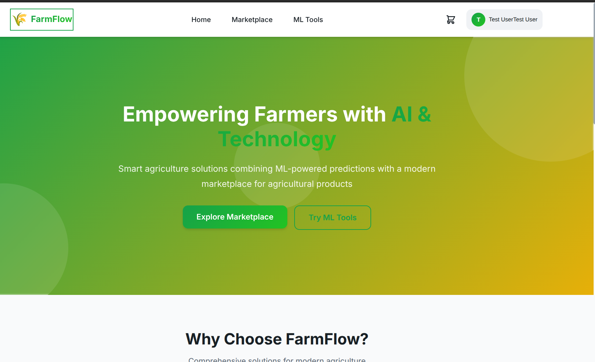
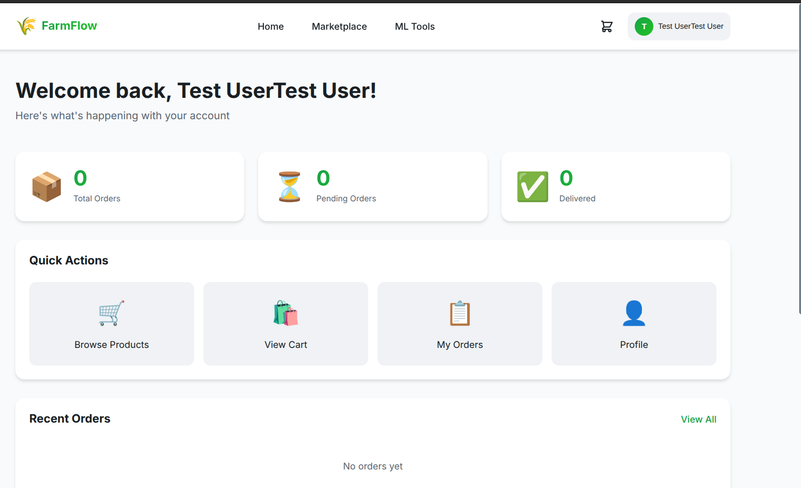
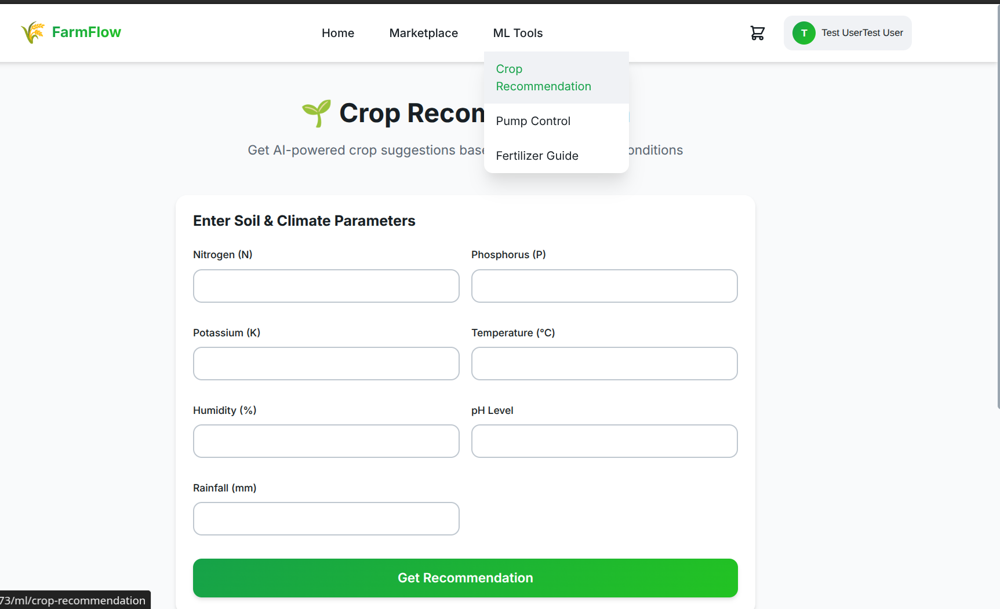
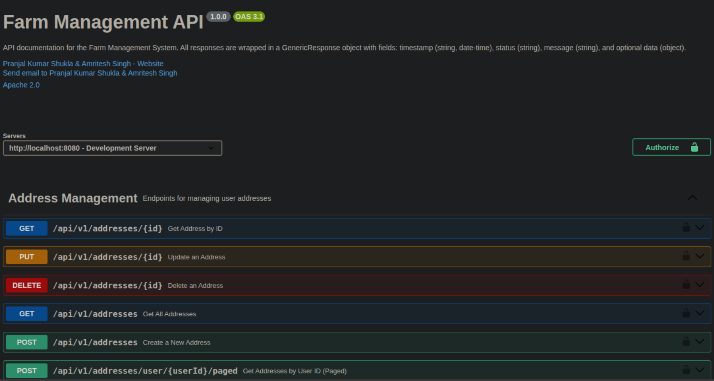
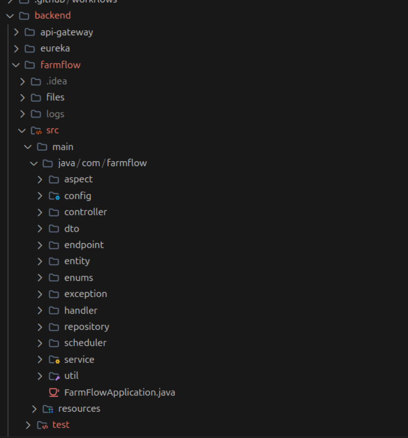

# 🌾 AgriProject – Microservices Platform

[](https://hub.docker.com/u/pranjalkumar09)
[](./LICENSE)

---

## 📖 Overview

**AgriProject** is a complete **microservices-based agriculture platform** with:

* **Spring Boot Backend** – 120+ REST APIs
* **React Frontend** – Modern, premium UI
* **Python ML Models** – 3 prediction models (95%+ accuracy)
* **Eureka Service Discovery** – Microservices orchestration
* **MySQL Database** – Data persistence

---

## 📸 Screenshots

### Frontend Application

*Modern, premium UI with responsive design*


*User dashboard and profile management*


*Machine Learning predictions with interactive UI*

### Backend & API

*Complete API documentation with 120+ endpoints*


*Organized microservices architecture*

---

## 🏗️ Architecture

```
agri-project/
├── backend/
│   ├── eureka/          # Service Discovery (port 8761)
│   └── farmflow/        # Main Backend (port 8080)
├── frontend/            # React App (port 5173)
├── ml/                  # ML Service (port 5000)
└── docker-compose.yml
```

---

## 🚀 Quick Start

### Prerequisites
- Docker & Docker Compose
- Node.js 18+ (for frontend development)
- Java 21 (for backend development)

### Run with Docker Compose

```bash
# Start all services
docker-compose up --build

# Or run in detached mode
docker-compose up -d
```

This will start:
- **MySQL** → `localhost:3306`
- **Eureka Server** → `http://localhost:8761`
- **Backend (AGRI-JAVA)** → `http://localhost:8080`
- **ML Service** → `http://localhost:5000`

### Run Frontend (Development)

```bash
cd frontend
npm install
npm run dev
```

Frontend will be available at `http://localhost:5173`

---

## 🔍 Service Endpoints

| Service | URL | Description |
|---------|-----|-------------|
| Frontend | http://localhost:5173 | React application |
| Backend API | http://localhost:8080/api/v1 | REST APIs |
| Eureka Dashboard | http://localhost:8761 | Service registry |
| ML Service | http://localhost:5000 | ML predictions |
| Swagger UI | http://localhost:8080/farmer_app_shopping-doc | API documentation |

---

## 🎯 Features

### Backend (FarmFlow)
- ✅ 120+ REST APIs
- ✅ JWT Authentication
- ✅ Role-based access (Admin, Farmer, User)
- ✅ Email verification
- ✅ Caching with Caffeine
- ✅ Pagination & Search
- ✅ File upload support
- ✅ Eureka client integration

### Frontend
- ✅ Modern React with Vite
- ✅ Premium glassmorphism UI
- ✅ Complete shopping flow (Cart → Checkout → Orders)
- ✅ Address management (37 Indian states)
- ✅ Product marketplace
- ✅ ML predictions interface
- ✅ User/Farmer/Admin dashboards
- ✅ Responsive mobile-first design

### ML Service
- ✅ Crop Recommendation (Model 5)
- ✅ Smart Pump Control (Model 6)
- ✅ Fertilizer Recommendation (Model 7)
- ✅ 95%+ accuracy

---

## 🔐 Default Credentials

**Database:**
- Username: `root`
- Password: `09072005`
- Database: `agri`

---

## 📝 Development

### Backend Development
```bash
cd backend/farmflow
./mvnw spring-boot:run
```

### Frontend Development
```bash
cd frontend
npm run dev
```

### Eureka Server
```bash
cd backend/eureka
./mvnw spring-boot:run
```

---

## 🐳 Docker Services

```yaml
services:
  - mysql (port 3306)
  - eureka (port 8761)
  - backend (port 8080)
  - ml (port 5000)
```

---

## 📊 Service Discovery

The backend automatically registers with Eureka as **AGRI-JAVA**. 

View registered services at: http://localhost:8761

---

## 🔧 Environment Variables

Set in `docker-compose.yml`:

```yaml
SPRING_DATASOURCE_URL=jdbc:mysql://mysql:3306/agri
EUREKA_CLIENT_SERVICEURL_DEFAULTZONE=http://eureka:8761/eureka/
```

---

## 📝 License

MIT License - see [LICENSE](./LICENSE)

---

## 👨‍💻 Authors & Collaborators

**Creator:**
- [shukla-pranjal](https://github.com/shukla-pranjal)

**Collaborator:**
- [Amritesh Singh](https://github.com/Amritesh-Singh-11)
